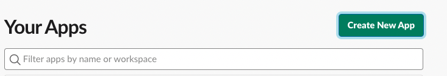
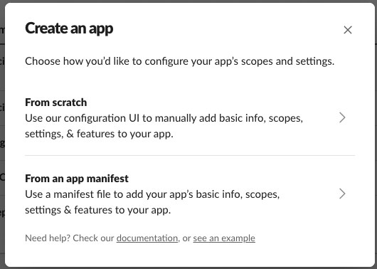
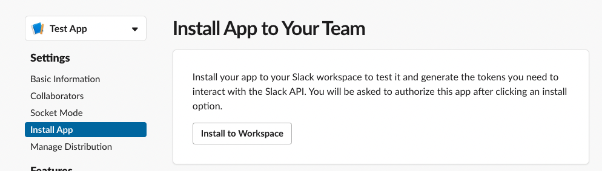
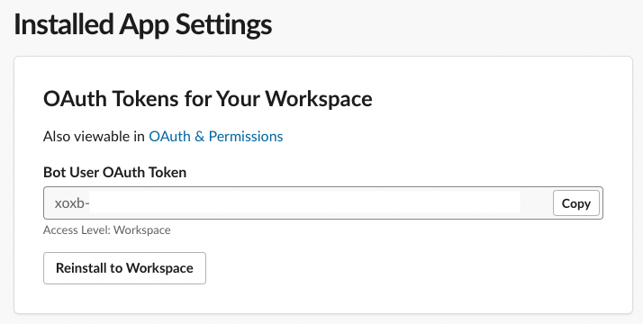
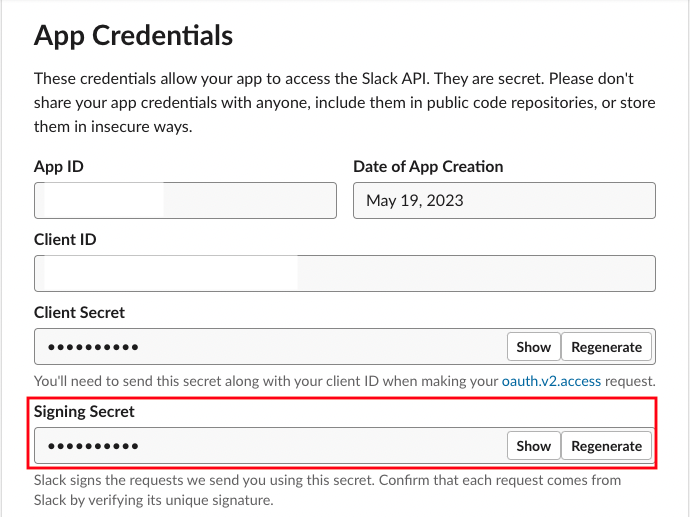
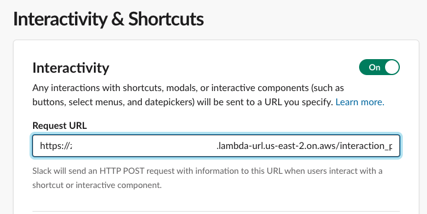
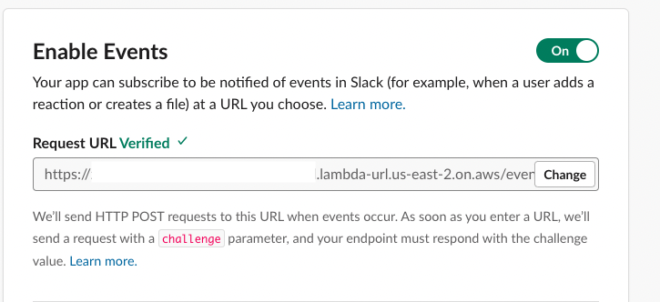

# inc-bot

inc-bot is a simple incident management Slack bot that can be deployed on AWS Lambda.

## Features

- Slash command to declare new incidents
- Dedicated per-incident Slack channels are created when an incident is declared
  - Channel naming convention: `#inc-YYYYMMDD-<formatted incident name>`
- Use app-mentions to invoke various commands
  - `oncall <SERVICE>`: Check who is currently oncall for a defined PagerDuty service
  - `oncall-teams`: Enumerate a list of defined PagerDuty services
  - `page <SERVICE> <MESSAGE>`: Send a page to the person on the oncall rotation for a defined PagerDuty service
  - `update-incident <MESSAGE>`: Broadcast an incident update to a configurable central incident channel
  - `resolve-incident <MESSAGE>`: Broadcast an incident resolution update to a configurable central incident channel
  - `handoff <@Slack User>`: Handoff incident commander role of an existing incident to another Slack user

  ## Setup

  ### First time setup

  #### Install Slack application

  A new slack application can be created via https://api.slack.com/apps and clicking "Create New App". This will bring up the following modal.

  

  When Slack prompts you whether you want to scratch or use an app-manifest, use the app-manifest `slack-app-manifest.yml` file in this repository to install the application.

  

  Installing the Slack application in your workspace is required to get the Slack signing secret and Bot OAuth Token that is required in the next step.

  

  Once installed, the Slack bot user OAuth Token should be available to you within Settings >> Install App.

  

  The Slack signing secret can be found in Settings >> Basic Information in the App Credentials section:

  

  #### Add required secrets in AWS Secrets Manager

  ```
  ./bin/add-secrets <AWS_REGION> <SECRETS_MANAGER_KEY> <SLACK_SIGNING_SECRET> <SLACK_BOT_OAUTH_TOKEN> <PAGERDUTY_API_KEY>
  ```

  - `SECRET_MANAGER_KEY` should be the key that is used to refer to the secret in AWS Secret Manager.
  - `SLACK_SIGNING_SECRET` and `SLACK_BOT_OAUTH_TOKEN` can be taken from your installed Slack application from the previous step.
  - `PAGERDUTY_API_KEY` - An API Key can be generated in your PagerDuty account via `Integrations` >> API Access Keys. This should be a full access API key since the `page` command creates a new incident in PagerDuty.

  #### Add services into pagerduty-config.json

  `pagerduty-config.json` contains a JSON array of PagerDuty services that can be enumerated / paged through the `oncall` , `oncall-teams` and `page` commands.

  Service names and input from the `oncall` and `page` commands have their names lowercased and dashes/underscores stripped as a form of resiliency against typos. (e.g. `App-Platform` is transformed into `appplatform`).

  There are three fields supported per service entry:

  ```json
  {
    "name": "test-svc",
    "aliases": [],
    "service_id": "PUIPTQ7"
  }
  ```

  `name` is the service name that can be referred to in the `oncall` or `page` commands.
  `aliases` refer to other common names that can be used to refer to this service.
  `service_id` refers to the PagerDuty service ID for the service.

  #### Installing AWS Lambda via Terraform

  Run `./bin/generate-lambda-zip-file` to generate the lambda ZIP file that Terraform expects for the first-time installation.

  inc-bot comes prepackaged as a Terraform module that contains the AWS Lambdas, IAM policies and a Lambda warmer (for preventing Lambda cold-starts).

  Example Terraform module code:
  ```terraform
  module "inc-bot" {
    source = "./inc-bot"

    name        = "inc-bot" # name prefix of AWS resources to be created
    secrets_key = "app/inc-bot/secrets" # SECRETS_MANAGER_KEY from previous step

    incident_broadcast_channel_id = "C23SFSW1L" # Central incident broadcast channel ID
    pagerduty_email               = "my-test-email@testing.com" # PagerDuty email that newly created incidents from `page` command should originate from
    enable_lambda_warmer          = false
  }
  ```

  You'll want to grab the Slack channel ID for the central broadcast channel for incidents, which can be done via right-clicking the desired channel in Slack >> View Channel Details. The Channel ID should be at the very bottom of the modal.

  Run the Terraform to install the Lambda: `terraform init && terraform apply`

  Once the AWS resources are installed, you can get the Lambda function URL via invoking the following terraform command:

  ```
  terraform state show 'module.inc-bot.aws_lambda_function_url.url_handlers["main"]'
  ```

  The `function_url` attribute should contain the URL that we'll be using to configure as a destination for Slack event and interactive payload webhooks.

  #### Configuring the Slack app to send payloads to the Lambda

  Let's assume the `function_url` we got is `https://abcdefghijklmnopqrs-1234567890.lambda-url.us-east-2.on.aws/`

  The endpoint for interactive payload webhooks should be `https://abcdefghijklmnopqrs-1234567890.lambda-url.us-east-2.on.aws/interactive_payload`

  

  The endpoint for event subscription webhooks should be `https://abcdefghijklmnopqrs-1234567890.lambda-url.us-east-2.on.aws/events`

  

  Slack sends a URL verification payload when setting up event subscriptions. This verification should succeed.

  ### Deploying Updates

  Updates to the lambda can be deployed via the `./bin/deploy` script. This includes when either Ruby source code or the `pagerduty-config.json` file is updated.

  The `./bin/deploy` script takes two arguments - it takes the AWS region and lambda prefix (or the `name` field in the terraform module used to create the AWS resources during the initial setup).

  Example: `./bin/deploy us-east-2 inc-bot`
